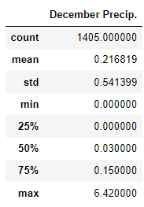
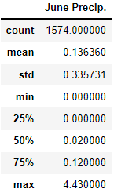
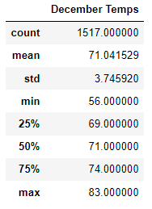
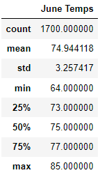

# Surf's Up with Advanced Data Storage and Retrieval

## Overview of the Advanced Data Retireval and Storgae
Upon completion of a review of precipitation data, we want to ensure that weather patterns will remain conducive to an ice cream shop year-round.  Therefore, temperature data must also be analyzed, specifically, for both June and December.

## Analysis Results  
* Precipitation Statistics 
  * December:  
    
  * June:  
    
* Temperature Statistics
  * December:  
    
  * June:  
   

## Key Differences Between June and December Weather
* On average, December is a "rainier" month in Oahu with a higher average rainfall.  Total rainfall in either month is less than one inch, on average, which is good for an ice cream business.
* On average, December is a "cooler" month in Oahu with a lower average temperature.  However, temperatures for both months are mild in the low-to-mid 70-degree range.
* Maximum Temperatures potential in either month isn't prohibatively bad; in fact higher temperatures would likely enocourage more business. 
* Maximum precipitation potential, however, seems high.  This could result in some very slow business days in December where Oahu may recieve 6 inches of rain.
* Deviations from the mean are only between .33 and .54 inches in precipitation, however.  Days of excessive precipitation should be rare.
* Deviations from the mean are only between 3.26 and 3.74 degrees.  Excessive temperature variability doesn't appear to be an issue in either month.

## Summary
Based on December and June data alone, there should not be too much precepitation and temperature variability or values that create a negative environment for a surf shop/ice cream shop.  Though the first two sections of the final analysis did not call for specific precipitation statistics for June and December in addtion to the temperature data, additional queries were created for these analyses.
  
* December Precipitation Query Code  
```python
dec_rain = []
dec_rain = session.query(Measurement.date, Measurement.prcp).filter(extract('month',Measurement.date)==12).all()
dec_rain_df = pd.DataFrame(dec_rain, columns=['Date', "December Precip."])
dec_rain_df.set_index(dec_rain_df['Date'], inplace=True)
dec_rain_df.drop(columns=['Date'])
```
  
* June Precipitation Query Code  
```python
jun_rain = []
jun_rain = session.query(Measurement.date, Measurement.prcp).filter(extract('month',Measurement.date)==6).all()
jun_rain_df = pd.DataFrame(jun_rain, columns=['Date', "June Precip."])
jun_rain_df.set_index(jun_rain_df['Date'], inplace=True)
jun_rain_df.drop(columns=['Date'])
```

I would caution using an analysis of only two months of the year.  Weather and precipitation analyses should be performed for every individual month in order to make appropriate busines planning decisions for slower or busier months due to weather.
